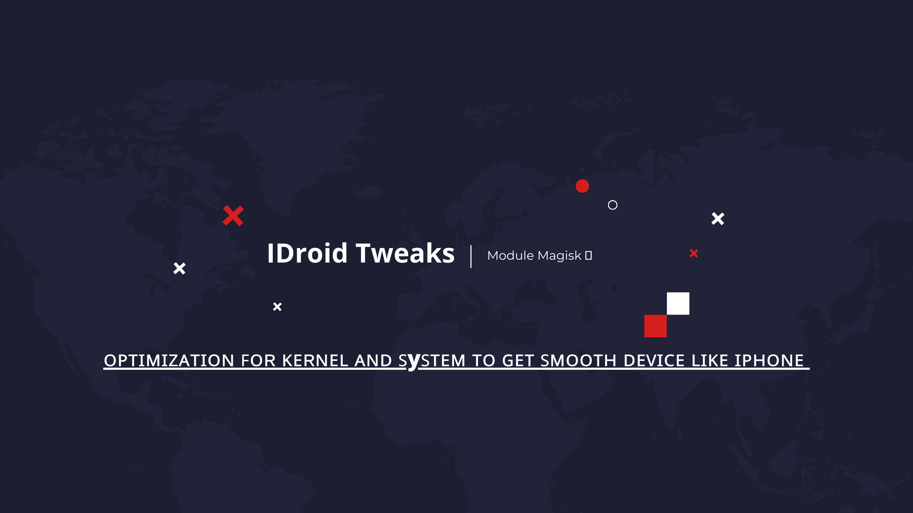

Optimization For Kernel And System To Get Smooth Device Like Iphone

## Installation

- Recommended Flash Use Magisk

## Look this

This module is an improvement of the <a href="https://github.com/rakarmp/DragonBoost">DragonBoost</a> module by adding many additions, see the changelog below

## Feature

- GPU Tunning
- Dvds & GPU Algorithm
- Graphic system properties tunning
- Disable input boost for unify Qualcomm
- Set up Hwui
- Ram+
- Set up for max background apps
- Memory properties
- Disable JIT
- JIT - limit JIT to minimal verification, no use of profiles
- JIT - reduce verifications with dex checksum before launch, and reduce logs
- Hypertheading & Multithread
- Define TCP buffer sizes for various networks
- Set up for kernel sched
- Set max freq for all cpu
- Loop over each CPU in the system
- Apply governor specific tunables for schedutil
- Apply governor specific tunables for interactive
- Set up for Cpusets
- Entropy
- Cpu Efficient
- Disable multi core power saving
- Disable V-Sync
- FileSystem (FS) optimized tweaks & enhancements
- LMP
- Surfaceflinger
- Unity fix
- Kernel panic off
- VM (Virtual Memory)
- Watermark boost
- Set up for I/O Scheduler
- Set up for loop, disable idle
- Set up for Stune Boost
- Lower Schedtune on background as it will consume quite a lot of power
- Foreground
- Off Ramdumps
- Top app boost
- Disable logs & debuggers
- Exynos hotplug
- Turn off msm_thermal
- Disable hotplug
- Clear uclamp
- Restart mi_thermald
- Stop services
- Better rendering speed
- Apply settings for miui
- Restart userspace thermal
- Skiagl Rendering
- Perf min-max core Cpu
- Touch tweaks
- Disable Dyn, Fps
- Wifi scanning+
- Upgrade multitasking

[!] Report Bug&Issued <a href="https://t.me/Zyarexx">@Zyarexx</a> Chat On Telegram
